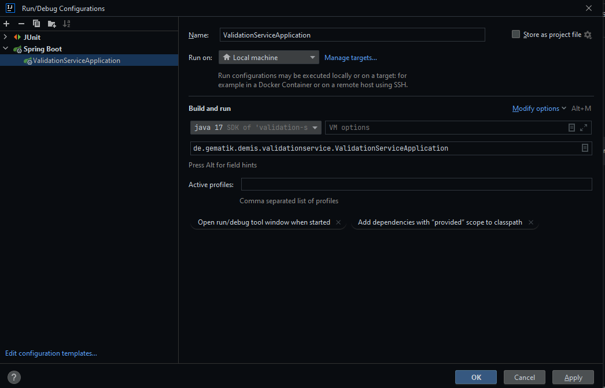

:doctype: book
:encoding: utf-8
:application-name: Validation-Service
:docker-registry: europe-west3-docker.pkg.dev/gematik-all-infra-prod/demis-dev
ifndef::env-github[]
image::Gematik_Logo_Flag.png[logo,width=200,height=37,role=right]
endif::[]
ifdef::env-github[]
++++
 <br/>
++++
endif::[]
= Validation-Service

image::https://sonar.prod.ccs.gematik.solutions/api/project_badges/measure?project=de.gematik.demis%3Avalidation-service&metric=alert_status&token=1625f4e36c06a30f797ae56839cc931512156967[Quality Gate Status]

image::https://sonar.prod.ccs.gematik.solutions/api/project_badges/measure?project=de.gematik.demis%3Avalidation-service&metric=vulnerabilities&token=1625f4e36c06a30f797ae56839cc931512156967[Vulnerabilities]

image::https://sonar.prod.ccs.gematik.solutions/api/project_badges/measure?project=de.gematik.demis%3Avalidation-service&metric=bugs&token=1625f4e36c06a30f797ae56839cc931512156967[Bugs]

image::https://sonar.prod.ccs.gematik.solutions/api/project_badges/measure?project=de.gematik.demis%3Avalidation-service&metric=code_smells&token=1625f4e36c06a30f797ae56839cc931512156967[Code Smells]

image::https://sonar.prod.ccs.gematik.solutions/api/project_badges/measure?project=de.gematik.demis%3Avalidation-service&metric=ncloc&token=1625f4e36c06a30f797ae56839cc931512156967[Lines of Code]

image::https://sonar.prod.ccs.gematik.solutions/api/project_badges/measure?project=de.gematik.demis%3Avalidation-service&metric=coverage&token=1625f4e36c06a30f797ae56839cc931512156967[Coverage]


++++
<details>
  <summary>Table of Contents</summary>
  <ol>
    <li>
      <a href="#about-the-project">About The Project</a>
      <ul>
        <li><a href="#release-notes">Release Notes</a></li>
      </ul>
    </li>
    <li>
      <a href="#getting-started">Getting Started</a>
      <ul>
        <li><a href="#prerequisites">Prerequisites</a></li>
        <li><a href="#installation">Installation</a></li>
      </ul>
    </li>
    <li><a href="#usage">Usage</a></li>
    <li><a href="#contributing">Contributing</a></li>
    <li><a href="#license">License</a></li>
    <li><a href="#contact">Contact</a></li>
  </ol>
</details>
++++

== About The Project

This service serves as a validation service for all notifications send to DEMIS. It uses a snapshot of all profiles and
the DEMIS-Schemas Project to validate any notification.

=== Release Notes

See `link:ReleaseNotes.md[ReleaseNotes]` for all information regarding the (newest) releases.

== Getting Started

The application requires the DEMIS FHIR Profiles, they can be retrieved from a git
repository, [https://gitlab.prod.ccs.gematik.solutions/git/demis/demis-profile-snapshots](demis-fhir-profiles).

The profiles are require to execute the unit and integration tests included in this repository. At runtime execution the
profile files must be available in a folder and this folder must be specified through the environment
variable `FHIR_PROFILES_PATH`.

=== Prerequisites


=== Installation

```sh
mvn clean verify
```

The Project can be built with the following command:

```sh
mvn -e clean install -DskipTests=true
```
build with docker image:

```docker
docker build -t europe-west3-docker.pkg.dev/gematik-all-infra-prod/demis-dev/validation-service:latest .
```
The Docker Image associated to the service can be built alternatively with the extra profile `docker`:

```docker
mvn -e clean install -Pdownload-profile -Pdocker
```

Without Profiles
```sh
mvn -e clean install -DskipTests=true -Pdocker
```

The application can be started as Docker container with the following commands:

```shell
docker run --rm --name validation-service \
    -v $(pwd)/profiles:/profiles \
    -p 8080:8080 \
    -e FHIR_PROFILES_PATH=/profiles \
    europe-west3-docker.pkg.dev/gematik-all-infra-prod/demis-dev/validation-service:latest
```
== Kubernetes

== Local

aus IntelliJ als SpringBoot Application starten




== Intellij/CMD

Start the spring boot server with: `mvn clean spring-boot:run`
Check the server with: `curl -v localhost:8080/actuator/health`

aus IntelliJ als SpringBoot Application starten


== VM


== Properties

[width="80%",cols="1,1,1"]
|===
| Property | Default Value | Description

| demis.validation-service.profileResourcePath | `/profile` | Path to the DEMIS profiles inside the resources.
| demis.validation-service.locale | `en_US` | Locale for the HAPI-FHIR context and validator. The language of diagnostics of the outcome is dependent on this locale.
| demis.validation-service.minSeverityOutcome | `information` | Minimal severity that will not be filtered out in the Outcome. Possible values: `information`, `warning`, `error`, `fatal`.
|===


== Usage

Start the spring boot server with: `mvn clean spring-boot:run`
Check the server with: `curl -v localhost:8080/actuator/health`

=== Endpoints

[width="80%",cols="1,1"]
|===
|Endpoint | Description

|`/status` | GET endpoint for status notifications. Currently minimally implemented.
|`/$validate` | POST endpoint for validating messages. Returns validation results from the HAPI Validator.
|`/actuator/health/` | Standard endpoint from Actuator.
|`/actuator/health/liveness` | Standard endpoint from Actuator.
|`/actuator/health/readiness` | Standard endpoint from Actuator.
|===

== Contributing

If you want to contribute, please check our [CONTRIBUTING.md](./CONTRIBUTING.md).

== License
EUROPEAN UNION PUBLIC LICENCE v. 1.2

EUPL © the European Union 2007, 2016

Copyright (c) 2023 gematik GmbH

See link:./LICENSE[license].

== Contact

Email to: link:mailto:demis-entwicklung@gematik.de?subject=%5BGitHub%5D%20Validation-Service[DEMIS Entwicklung]
